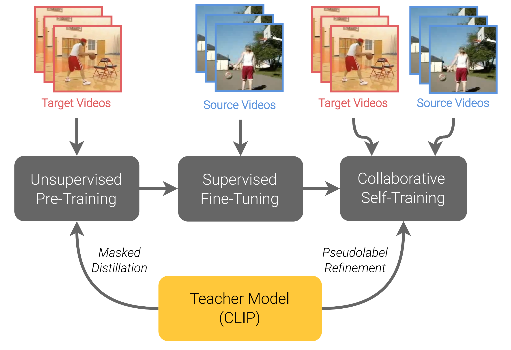

<div align="center">

<br />
<p align="center">
  <h3 align="center"><strong>Unsupervised Video Domain Adaptation with<br>Masked Pre-Training and Collaborative Self-Training</strong></h2>
</p>
</div>

<div align="center">

[](https://openaccess.thecvf.com/content/CVPR2024/papers/Reddy_Unsupervised_Video_Domain_Adaptation_with_Masked_Pre-Training_and_Collaborative_Self-Training_CVPR_2024_paper.pdf)
[](https://openaccess.thecvf.com/content/CVPR2024/supplemental/Reddy_Unsupervised_Video_Domain_CVPR_2024_supplemental.pdf)
[](https://arxiv.org/abs/2312.02914)
[](https://www.youtube.com/watch?v=dDjCVnkuhGg)
[](https://gitlab.jhuapl.edu/reddyav1/unite/-/blob/main/LICENSE)
[](#citation)

</div>

## About

UNITE is a three-stage approach for unsupervised video domain adaptation that uses a powerful image-based teacher model to adapt a video student model to the target domain. In the first stage, unsupervised pre-training is performed on target domain videos using the Unmasked Teacher objective. The second stage employs supervised fine-tuning on source domain videos. The third stage involves collaborative self-training, where both student and teacher model predictions are used to further adapt to the target domain.

<div align="center">
<p align="center">

</p>
</div>

## Getting Started

### Data Preparation

Please download the datasets from their original sources and update `dataset_mappings.yaml` with the correct paths to your `.csv` annotations files, which should be of the form `/path/to/video.mp4,<class_id>`.

To facilitate getting started, we provide data and our annotations files for the ARID-HMDB (A&#8594;H) domain shift in Daily-DA [here](https://www.cis.jhu.edu/~areddy/unite_cvpr24/). Remember to update the paths in the annotations files to point to your videos.

### Download Checkpoints

#### Student Model
The student model in UNITE is initialized from the Unmasked Teacher (UMT) checkpoint pre-trained on Kinetics-710 (ViT-B/16). You can find a link to this checkpoint in the [UMT repository](https://github.com/OpenGVLab/unmasked_teacher/blob/main/single_modality/MODEL_ZOO.md), or can directly download it from [here](https://www.cis.jhu.edu/~areddy/unite_cvpr24/checkpoints/b16_ptk710_f8_res224.pth).

#### Teacher Model
Like UMT, we use [CLIP](https://github.com/openai/CLIP) as the teacher model by default:
- Follow [extract.ipynb](./src/models/extract_clip/extract.ipynb) to extract visual encoder from CLIP.
- Change `MODEL_PATH` in [clip.py](./src/models/clip.py).

### Environment
We recommend you create a conda environment to run UNITE. Our environment is provided in `environment.yaml.` You can create your own by running:

```
conda env create --name unite --file environment.yaml
```

## Running UNITE

Each of the three stages in UNITE is separated into its own Python file. We provide bash scripts that will launch distributed training for each stage (`stage<X>.sh`), currently configured for the ARID-HMDB (A&#8594;H) domain shift from Daily-DA as an example.

You will need to update the output directory and student model initialization checkpoint path in `stage1.sh`. In `stage2.sh` and `stage3.sh`, specify the `ckpt_path` to point to the desired output checkpoint from the previous stage.

## Acknowledgement

This repository was built based on [Unmasked Teacher](https://github.com/OpenGVLab/unmasked_teacher).

This research was sponsored by the Army Research Laboratory under Cooperative Agreement W911NF-21-2-0211. The views and conclusions contained in this document are those of the authors and should not be interpreted as representing the official policies, either expressed or implied, of the Army Research Office or the U.S. Government. The U.S. Government is authorized to reproduce and distribute reprints for Government purposes notwithstanding any copyright notation herein.

<a name="citation"></a>
## Citation
```
@inproceedings{reddy2024unite,
  title={Unsupervised Video Domain Adaptation with Masked Pre-Training and Collaborative Self-Training},
  author={Reddy, Arun and Paul, William and Rivera, Corban and Shah, Ketul and de Melo, Celso M and Chellappa, Rama},
  booktitle={Proceedings of the IEEE/CVF Conference on Computer Vision and Pattern Recognition (CVPR)},
  pages={18919--18929},
  year={2024}
}
```

## License

This project is released under the MIT License.

Copyright (c) 2024 The Johns Hopkins University Applied Physics Laboratory
